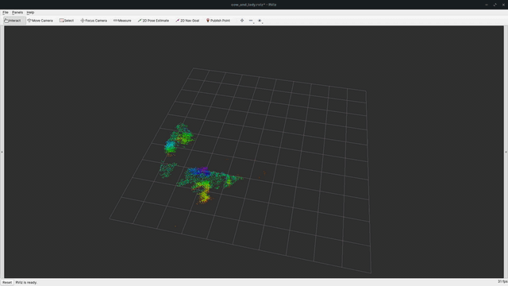

# NanoVoxMap ROS 1 Noetic wrapper

<p align="center">
  
</p>

This branch wraps [NanoVoxMap](https://github.com/kunalnk123690/nanovoxmap) as a ROS 1 Noetic node.

The wrapper synchronizes `sensor_msgs/PointCloud2` with `nav_msgs/Odometry`, integrates occupied and free voxels, and publishes the occupied map and an optional signed ESDF point cloud.

For the ROS 2 Jazzy wrapper, see the repository's [`main` branch](https://github.com/kunalnk123690/nanovoxmapROS/tree/main).

## Clone

NanoVoxMap is embedded as a Git submodule, so clone recursively:

```bash
cd ~/catkin_ws/src
git clone --branch noetic --recurse-submodules \
  https://github.com/kunalnk123690/nanovoxmapROS.git
```

For an existing clone made without submodules:

```bash
git submodule update --init --recursive
```

## Build

Install dependencies and build from the workspace root. NanoVoxMap requires CMake 3.18 or newer (newer than Ubuntu 20.04's stock CMake):

```bash
rosdep install --from-paths src --ignore-src -r -y
catkin_make
source devel/setup.bash
```

Edit `nanovoxmap_ros/config/mapping.yaml` for the input topics, frame, mapping, clearing, and ESDF settings. Run only the mapper with:

```bash
rosparam load "$(rospack find nanovoxmap_ros)/config/mapping.yaml" /nanovoxmap_node
rosrun nanovoxmap_ros nanovoxmap_ros_node
```
or include the following in your launch file:
```
<node name="nanovoxmap_node" pkg="nanovoxmap_ros" type="nanovoxmap_ros_node" output="screen">
  <rosparam file="$(find nanovoxmap_ros)/config/mapping.yaml"/>
</node>
```

The `nanovoxmap_example` package contains the Jackal Gazebo example:

```bash
roslaunch nanovoxmap_example mapping.launch
```

The odometry pose must describe the point-cloud sensor in the configured world frame; the wrapper does not apply an additional sensor-to-base transform.

## License

BSD 3-Clause. See [LICENSE](LICENSE).
